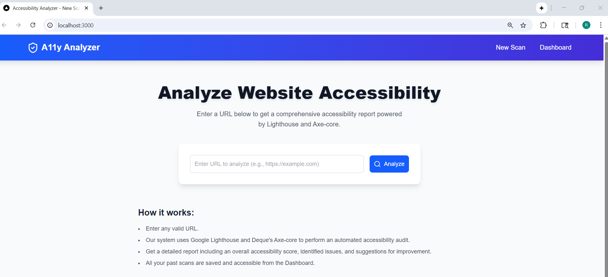
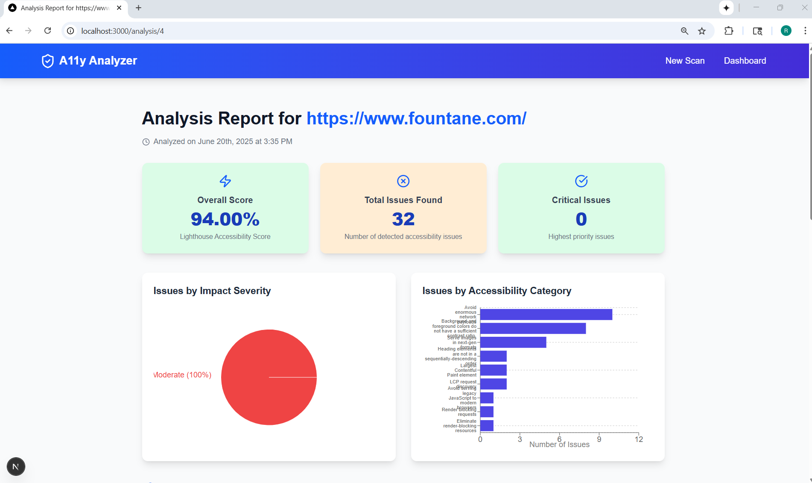
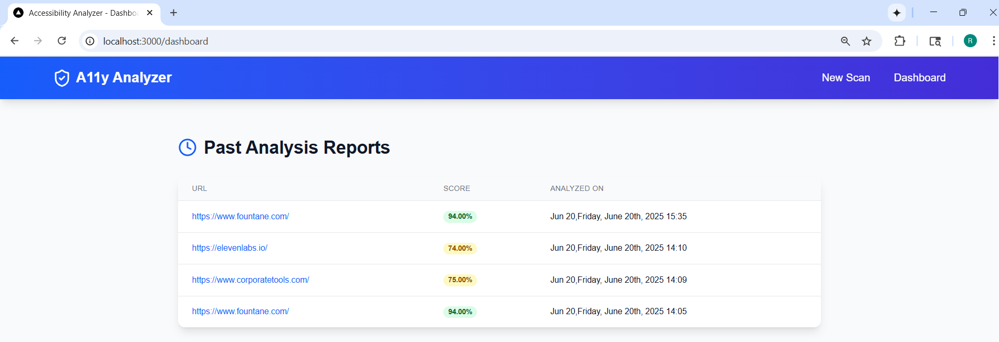

# A11y Analyzer

A11y Analyzer is a full-stack web tool that evaluates website accessibility using Google Lighthouse and Deque's Axe-core. Users can scan URLs, view automated audit reports, and explore detailed issue breakdowns categorized by severity and accessibility rules.

## 📸 Screenshots

### 🔍 Home Page


### 📊 Dashboard


### 📋 Detailed Report



## 🚀 Features

- 🔍 Scan any public URL for accessibility issues using Lighthouse.
- 📊 Get detailed reports with overall score, critical issues, and issue categorization.
- 📁 Store and browse past analyses on the dashboard.
- 📉 Visualize results using interactive Pie and Bar charts.
- 💡 View issue descriptions, impacted elements, and fix recommendations.

---

## 🛠️ Tech Stack

- **Frontend:** Next.js, React, Tailwind CSS, Recharts, Lucide Icons
- **Backend:** Node.js, Next.js API Routes
- **Database:** PostgreSQL
- **Accessibility Tools:** Google Lighthouse, Axe-core
- **Charts & Visualization:** Recharts
- **Data Fetching:** `fetch`, REST-style API
- **Hosting Ready:** Vercel (frontend) + Render (PostgreSQL)

---


## ⚙️ Setup & Run Locally

### Prerequisites:
- Node.js v18+
- PostgreSQL database
- Chrome installed (for Lighthouse + Puppeteer)

### Steps:

1. **Clone the repository**
```bash
git clone https://github.com/riddhidhanani/accessibility-analyzer.git
cd accessibility-analyzer
````

2. **Install dependencies**

```bash
npm install
```

3. **Configure environment**

```bash
cp .env.local.example .env.local
# Fill in DATABASE_URL for your PostgreSQL database
```

4. **Run the development server**

```bash
npm run dev
```

5. **Navigate to**

```
http://localhost:3000
```

---

## 📌 Project Highlights

* Full Lighthouse + Axe-core integration for real-world WCAG testing.
* Clean, modular UI with visual breakdowns of accessibility issues.
* Grouped issue reporting with impacted HTML snippets.
* Dashboard to track and revisit analysis history.

---

